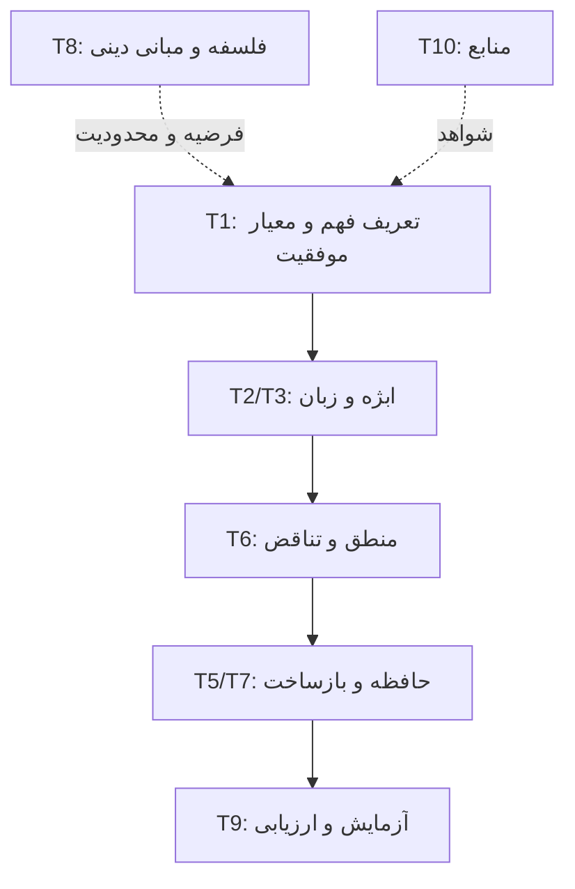

# نقشهٔ موضوعی محتوا

## دسته‌ها

| کد | دسته | پرسش محوری | منابع اصلی در مخزن | وضعیت |
|---|---|---|---|---|
| T1 | تعریف مسئله و هدف | «فهم» دقیقاً چیست و موفقیت چگونه سنجیده می‌شود؟ | `1_roadmap`, `SSOC:0,26,70`, `deep_think` | مهم، هنوز تعریف عملیاتی ندارد |
| T2 | ابژه و هستی‌شناسی | ابژه چگونه ساخته، شناخته و از نمونه/مفهوم جدا می‌شود؟ | `SSOC:0,7,16,35,60`, `code` | مولد، ولی مدل داده رسمی ندارد |
| T3 | زبان و معنا | متن چگونه بدون ابهام به مفهوم و رابطه تبدیل می‌شود؟ | `book`, `deep_think`, `core_of_Innate_knowledge:0-1`, `SSOC:40` | یکی از گلوگاه‌های واقعی |
| T4 | ادراک و حس | ورودی حسی چگونه به ابژه تبدیل می‌شود؟ | `SSOC`, `Essential_Motion`, `reflect` | زودهنگام؛ فعلاً فقط نام یک لایه است |
| T5 | حافظه و یادگیری | تجربه چگونه حفظ می‌شود و ساختار را تغییر می‌دهد؟ | `SSOC:7,35,60`, `reflect:47-48` | ادعا زیاد؛ پیاده‌سازی معتبر ندارد |
| T6 | منطق و استنتاج | کدام منطق، با چه عدم‌قطعیت و چه قواعدی؟ | `AI-Aristotle`, `intelegence_core`, `aristotle_logic.py`, `core_of_Innate_knowledge` | بهترین نامزد برای آزمایش محدود |
| T7 | بازتاب و خودساختاردهی | سیستم دقیقاً چه چیزی را با چه معیار و محدودیتی تغییر می‌دهد؟ | `reflect`, `code`, `SSOC:0,35,60` | اصطلاح‌ها تعریف عملیاتی ندارند |
| T8 | خودآگاهی و مبانی فلسفی/دینی | رابطهٔ آگاهی، روح، حرکت جوهری و ارزش چیست؟ | `Essential_Motion`, `reflect:9,16,30,36`, `book` | باید از هستهٔ مهندسی جدا بماند تا قابل‌آزمایش شود |
| T9 | معماری و کد | اجزا، قراردادها، حالت و آزمون‌ها چیست؟ | `code`, `intelegence_core`, `reflect:37-48`, `SSOC:36` | PoC نمایشی؛ معماری اجرایی نیست |
| T10 | کارهای مرتبط و منابع | چه چیز واقعاً در پژوهش موجود است؟ | `SSOC:55-56`, `reflect:0,21,25`, `AI-Aristotle` | نیازمند راستی‌آزمایی جدی |
| T11 | برنامه و آموزش | چه چیز باید خوانده یا ساخته شود؟ | `1_roadmap`, `SSOC:16,35,47`, `book` | چند Roadmap ناسازگار و تکراری |

## ارتباط پیشنهادی، بدون تغییر فایل‌های اصلی

## مسیرهای مولد

- تبدیل زبان محدود به نمایش صوری همراه با ثبت منبع و میزان اطمینان.
- تشخیص تناقض روی گزاره‌های صریح و مجموعه‌آزمون کنترل‌شده.
- ساخت گراف مفهوم/نمونه/رابطه با تاریخچهٔ تغییرات.
- بازساخت محدود و قابل‌برگشت بر اساس معیار روشن، نه «تغییر آزاد منطق».
- استفاده از مدل زبانی فقط به‌عنوان پیشنهاددهنده یا parser و الزام به اعتبارسنجی هستهٔ مستقل.

## مسیرهای غیرمولد در شکل فعلی

- شروع هم‌زمان از روح، خودآگاهی، زبان، حس، منطق، ارزش و معماری کامل.
- استفاده از پاسخ «من چی هستم؟» به‌عنوان آزمون خودآگاهی.
- نام‌گذاری چند تابع hard-coded به‌عنوان metacognition یا self-structuring.
- نتیجه‌گیری دربارهٔ «فهم واقعی» بدون معیار رفتاری یا آزمون ابطال‌پذیر.
