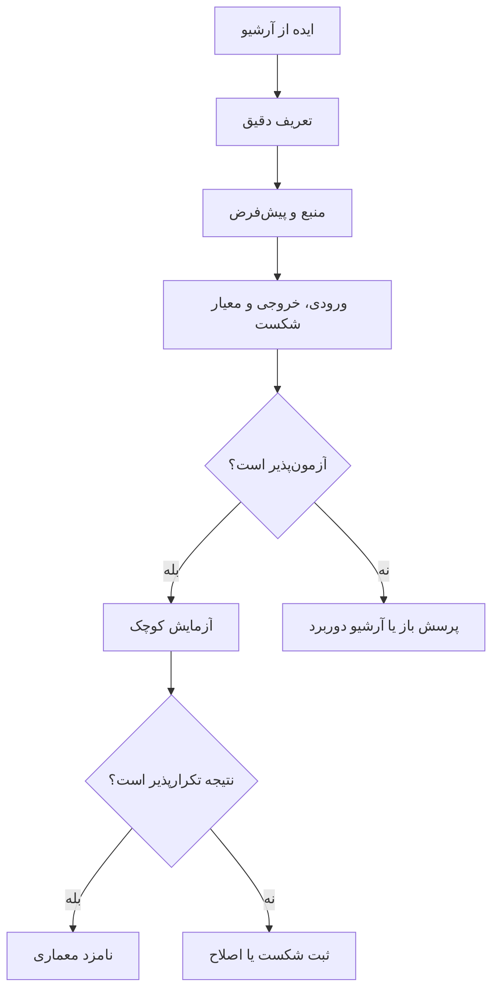

# کارت امتیاز ایده‌ها

این جدول ارزش فلسفی ایده‌ها را نمی‌سنجد؛ فقط مشخص می‌کند کدام ایده در مرحلهٔ فعلی می‌تواند وارد آزمایش فنی شود.

امتیازها: `۰` بسیار ضعیف، `۱` ضعیف، `۲` متوسط، `۳` قوی.

| ایده | ارزش پژوهشی | آزمون‌پذیری فعلی | پشتوانهٔ فعلی مخزن | تصمیم فعلی |
|---|---:|---:|---:|---|
| زبان کنترل‌شده → ساختار صوری | ۳ | ۳ | ۲ | شروع شود |
| گراف ابژه/رابطه با منشأ گزاره | ۳ | ۳ | ۲ | شروع شود |
| منطق محدود و توضیح‌پذیر | ۳ | ۳ | ۲ | شروع شود |
| تشخیص تناقض مشخص | ۳ | ۳ | ۱ | بازنویسی و آزمون شود |
| حافظه با تاریخچه و rollback | ۳ | ۲ | ۱ | پس از تعریف schema |
| بازساخت محدود براساس معیار | ۳ | ۲ | ۱ | آزمایش مرحلهٔ دوم |
| LLM به‌عنوان parser پیشنهادی | ۲ | ۳ | ۱ | با baseline مقایسه شود |
| ادراک حسی و چندرسانه‌ای | ۲ | ۱ | ۰ | فعلاً متوقف |
| بدیهیات ثابت جامع | ۲ | ۱ | ۱ | ابتدا دامنه و تعارض تعریف شود |
| حرکت جوهری به‌عنوان الگوریتم | ۱ | ۰ | ۰ | فعلاً آرشیو فلسفی |
| پاسخ هویتی به‌عنوان خودآگاهی | ۰ | ۰ | ۱ | به‌عنوان معیار رد شود |
| ساخت هم‌زمان ذهن کامل | ۱ | ۰ | ۰ | برای MVP رد شود |

## چرخهٔ ورود یک ایده

## قالب ثبت ایدهٔ جدید

هر ایدهٔ جدید باید با این فیلدها ثبت شود:

- شناسه و عنوان
- لینک به فایل و سلول منبع
- تعریف کوتاه و وفادار
- مسئله‌ای که حل می‌کند
- پیش‌فرض‌ها
- ورودی و خروجی
- معیار موفقیت و معیار شکست
- شواهد موافق و مخالف
- امتیاز ارزش پژوهشی، آزمون‌پذیری و پشتوانه
- تصمیم: اجرا، مشروط، تعلیق یا رد در شکل فعلی

پیوندها: [[docs/knowledge_map/project_flow|مسیر پروژه]]، [[docs/knowledge_map/research_dashboard|داشبورد]] و [[docs/inventory/cell_index|نمایهٔ سلول‌ها]].
