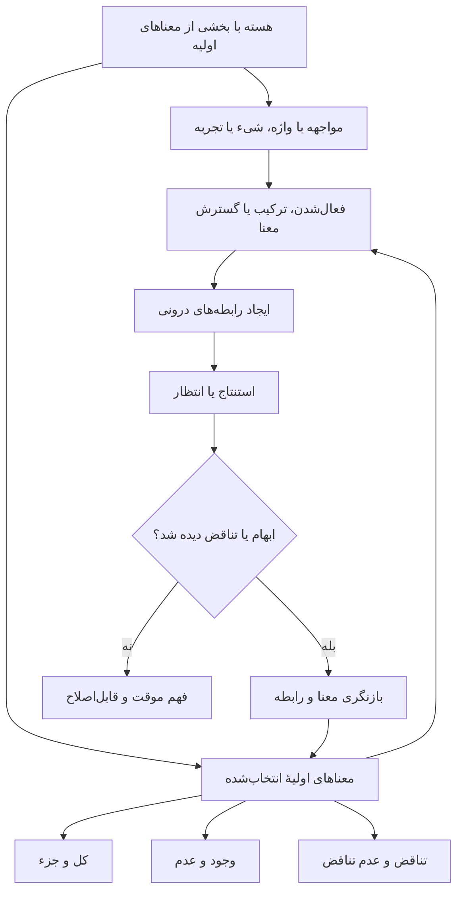

# نقشهٔ درونی ۱: فهم و شکل‌گیری معنا

## هدف و مرز این سند

این سند نظریهٔ نهایی نیست. هدفش بازسازی پرسش‌های درونی پروژه با زبان خود آرشیو است.

سه نوع محتوا از هم جدا شده‌اند:

- **گفتهٔ تو:** پرسش یا موضعی که در متن‌های اصلی از طرف کاربر مطرح شده است.
- **برداشت کاری:** رابطه‌ای که فعلاً از کنار هم گذاشتن گفته‌ها دیده می‌شود و هنوز باید تأیید شود.
- **پرسش باز:** چیزی که متن‌های اصلی هنوز درباره‌اش تصمیم روشنی ندارند.

در این مرحله هیچ نظریهٔ بیرونی معیار دسته‌بندی نیست و پاسخ‌های تولیدشدهٔ قبلی نیز به‌عنوان نظر تو ثبت نشده‌اند.

## پرسش مرکزیِ بازسازی‌شده

> چه قابلیت اولیه‌ای باعث می‌شود ذهن فقط پاسخ درست تولید نکند، بلکه ابژه‌ها را تشخیص دهد، میان معناهای متفاوت تمایز بگذارد، رابطه بسازد، تناقض معنایی را بفهمد و در اثر این فرایند ساختار شناختی خود را تغییر دهد؟

**وضعیت:** برداشت کاری؛ نیازمند تأیید تو.

## گفته‌های محوری تو در آرشیو

| شناسه | خلاصهٔ وفادار گفتهٔ تو | منبع |
|---|---|---|
| U-M01 | آیا فهم به یک «دیکشنری ذهنی» از معناها نیاز دارد، یا می‌توان ساختار آغازین دیگری داشت؟ | [[deep_think.ipynb]]، سلول ۰ و ۱ |
| U-M02 | ساختار اولیه شاید به‌جای فهرست معناها، یک هسته از اصول عقلانی مانند عدم تناقض و کل/جز باشد. | [[deep_think.ipynb]]، سلول ۱ |
| U-M03 | مسئله فقط درستی صورت قیاس نیست؛ «مواد» می‌توانند خراب باشند و اشتراک لفظی استنتاج را فاسد کند. | [[1_roadmap.ipynb]]، سلول ۱۱؛ [[core_of_Innate_knowledge.ipynb]]، سلول ۱ |
| U-M04 | پیش از انتخاب منطق ارسطویی باید بفهمیم انسان چگونه اشتراک لفظی، معنای متفاوت و خطای ماده را تشخیص می‌دهد. | [[1_roadmap.ipynb]]، سلول ۱۱ |
| U-M05 | نقطهٔ شروع مطلوب «هستهٔ بدیهیات، فطرت و عامه‌فهم» است، نه صرفاً یک کتابخانهٔ قیاس. | [[core_of_Innate_knowledge.ipynb]]، سلول ۱ |
| U-M06 | پاسخ‌های درست شبکهٔ عصبی ممکن است توهم هوش ایجاد کنند؛ هنوز روشن نیست «هوش مرکزی/عقل» چیست. | [[1_roadmap.ipynb]]، سلول ۱۳ |
| U-M07 | سیستم مطلوب باید خودش معنا بسازد و ساختارهای معنایی را درونی کند، نه اینکه فقط معنا یا برچسب آماده را دریافت کند. | [[SSOC.ipynb]]، سلول ۰ |
| U-M08 | شاید پیش از بهترکردن ماشین، لازم باشد حوزهٔ فهم خودمان از ذهن و هوش را بیشتر کنیم؛ و شاید ساختن مدل نیز وسیلهٔ فهمیدن ضعف نظریه باشد. | [[SSOC.ipynb]]، سلول ۷۰ |
| U-M09 | کودک با آموزش محدود یاد می‌گیرد؛ پروژه در پی ساختاری است که مانند این رشد کند، اما مشکلات AI فعلی را نداشته باشد. | [[1_roadmap.ipynb]]، سلول ۰ |
| U-M10 | بخشی از معناها از ابتدا در هسته وجود دارند؛ بنابراین هسته فقط ظرفیت یا قواعد ساخت معنا نیست. | تصمیم مستقیم کاربر، ۲۰۲۶-۰۸-۱۱ |
| U-M11 | «کل و جزء»، «وجود و عدم» و «تناقض و عدم تناقض» سه مصداق انتخاب‌شده برای معناهای موجود در هسته‌اند. | تصمیم مستقیم کاربر، ۲۰۲۶-۰۸-۱۱ |

## نقشهٔ درونیِ موقت

این نمودار اکنون وجودِ بخشی از معناهای اولیه و سه مصداق انتخاب‌شده را موضع تأییدشدهٔ کاربر می‌داند. اما هنوز مشخص نمی‌کند این سه چه رابطه‌ای با هم دارند و تجربه آن‌ها را فعال، ترکیب، تفکیک یا گسترش می‌دهد؛ این افعال فعلاً فرضیه‌های کاری‌اند.

## لایه‌های مفهومی که از متن جدا می‌شوند

### ۱. قابلیت آغازین

**گفتهٔ تو:** بخشی از معناها از ابتدا در هسته وجود دارند؛ بنابراین نقطهٔ شروع صرفاً مجموعه‌ای از قواعد یا ظرفیت‌های بی‌محتوا نیست.

**برداشت کاری:** هسته احتمالاً هم «محتوای معنایی اولیه» دارد و هم سازوکاری برای کارکردن با تجربه؛ اما نوع محتوا و سازوکار آن هنوز تعیین نشده است.

**پرسش باز:** کدام معناها اولیه‌اند؟ آیا بدیهیات، فطرت، عقل، سازوکار تمایز و سازوکار یادگیری یک چیزند یا چند لایهٔ متفاوت؟

### ۲. تشکیل ابژه

**گفتهٔ تو:** مدل باید حالت ابژه‌ای و ساختار درونی داشته باشد و معنا را صرفاً از برچسب بیرونی نگیرد.

**برداشت کاری:** پیش از رابطه‌دادن به مفهوم‌ها، سیستم باید تعیین کند چه چیزی «یک واحد» است و چه چیزی با واحد دیگر فرق دارد.

**پرسش باز:** معیار جداکردن یک ابژه از زمینه چیست؛ تکرار، مرز حسی، کارکرد، رابطه یا چیزی دیگر؟

### ۳. معنا

**گفتهٔ تو:** معنا با اتصال مفهوم‌ها و رابطه‌های معنایی مطرح می‌شود، اما شاید چیزی درونی نیز پیش از آن وجود داشته باشد.

**موضع تأییدشدهٔ تو:** بخشی از معناها از ابتدا در هسته وجود دارند.

**مرز این تصمیم:** این گزاره نمی‌گوید همهٔ معناها از پیش آماده‌اند و هنوز تعیین نمی‌کند معناهای بعدی «ساخته»، «کشف» یا از ترکیب معناهای اولیه پدیدار می‌شوند.

**انتخاب تأییدشدهٔ تو:** سه مصداق فعلی عبارت‌اند از «کل و جزء»، «وجود و عدم» و «تناقض و عدم تناقض».

**مرز این انتخاب:** هنوز تعیین نشده که این سه هم‌سطح و مستقل‌اند، یا یکی زیربنای پیدایش/فهم دو مورد دیگر است. همچنین هنوز روشن نیست آن‌ها «محتوای معنایی»، «رابطهٔ پایه» یا «اصل داوری» هستند؛ این تفکیک نباید بدون نظر تو تحمیل شود.

**پرسش باز:** رابطهٔ درونی این سه چیست و تجربه دقیقاً چه تغییری در آن‌ها ایجاد می‌کند؟

### ۴. ابهام و اشتراک لفظی

**گفتهٔ تو:** «باز» می‌تواند چند معنا داشته باشد و صورت منطقی صحیح نمی‌تواند به‌تنهایی انتخاب معنای درست را تضمین کند.

**برداشت کاری:** تشخیص تناقض پس از تعیین معنا اتفاق می‌افتد؛ بنابراین اصل عدم تناقض به‌تنهایی نمی‌تواند تعیین کند دو کاربرد یک واژه واقعاً دربارهٔ یک مفهوم‌اند یا دو مفهوم متفاوت.

**پرسش باز:** چه چیزی هویت معنایی را تعیین می‌کند: زمینه، حافظه، تجربه، هدف، رابطه با ابژه‌های دیگر یا ترکیبی از آن‌ها؟

### ۵. فهم در برابر پاسخ درست

**گفتهٔ تو:** انبوه پاسخ‌های درست می‌تواند توهم هوش بسازد.

**برداشت کاری:** در این پروژه، «فهم» باید چیزی بیشتر از تطبیق خروجی با پاسخ صحیح باشد؛ احتمالاً شامل تشکیل ابژه، حفظ تفاوت معناها، توضیح رابطه و اصلاح ساختار در مواجهه با خطا است.

**پرسش باز:** حداقل نشانه‌ای که پاسخ درست را از فهم جدا می‌کند چیست؟

### ۶. بازنگری

**گفتهٔ تو:** سیستم باید با تجربه رشد کند و ساختار خودش را بسازد.

**برداشت کاری:** بازنگری فقط افزودن یک گره یا حذف یک پاسخ نیست؛ باید نشان دهد کدام معنا، رابطه یا اصل به چه دلیل تغییر کرده است.

**پرسش باز:** چه بخشی از هسته می‌تواند تغییر کند و چه بخشی باید ثابت بماند تا هویت شناختی سیستم از بین نرود؟

## تعارض‌های مولد، نه ایرادهای حذف‌شدنی

| شناسه | دو قطب موجود در فکر | چرا مهم است؟ |
|---|---|---|
| T-M01 | معناهای اولیهٔ درونی ↔ معناهای شکل‌گرفته در تجربه | وجود بخشی از محتوای اولیه تأیید شده؛ اکنون باید مرز و تعامل این دو روشن شود. |
| T-M02 | بدیهیات ثابت ↔ ساختار خودبازنویس | بدون مرز تغییر، مدل یا خشک می‌شود یا هویت خود را از دست می‌دهد. |
| T-M03 | منطق برای تشخیص خطا ↔ نیاز به معنا پیش از اجرای منطق | نشان می‌دهد منطق به‌تنهایی منشأ فهم نیست. |
| T-M04 | استقلال از دادهٔ حجیم ↔ نیاز به تجربه و زمینه | باید فرق «دادهٔ کمتر» با «بی‌نیازی از تجربه» روشن شود. |
| T-M05 | هوش مرکزی ↔ شناخت توزیع‌شده و رابطه‌ای | هنوز معلوم نیست مرکز باید یک ماژول باشد یا خاصیت کل فرایند. |

## چیزی که فعلاً نباید قطعی فرض شود

- اینکه هسته الزاماً منطق ارسطویی است.
- اینکه بدیهیات همان فطرت‌اند.
- اینکه تشخیص تناقض مساوی فهم است.
- اینکه گراف رابطه‌ها به‌خودی‌خود معنا می‌سازد.
- اینکه پاسخ درست یا پاسخ هویتی نشانهٔ آگاهی است.
- اینکه چون بخشی از معناها اولیه‌اند، پس همهٔ معناها از پیش آماده‌اند.
- اینکه فهرست معناهای اولیه به همین سه مورد محدود است.
- اینکه سه مورد انتخاب‌شده الزاماً هم‌سطح، مستقل یا از یک نوع‌اند.
- اینکه نظریهٔ چامسکی، فطرت دینی و بدیهیات فلسفی دقیقاً یک مفهوم را بیان می‌کنند.

## تصمیم‌های ثبت‌شده و گام بعد

دو تصمیم ثبت شد:

> بخشی از معناها از ابتدا در هسته وجود دارند.

> «کل و جزء»، «وجود و عدم» و «تناقض و عدم تناقض» مصداق‌های فعلیِ انتخاب‌شده‌اند.

پرسش بعدی این است:

> این سه معنا مستقل و هم‌سطح‌اند، یا میان آن‌ها تقدم و وابستگی وجود دارد؟

تا این رابطه با زبان خودت مشخص نشود، نباید از طرف پروژه سلسله‌مراتب یا معماری هسته را تثبیت کنیم.
