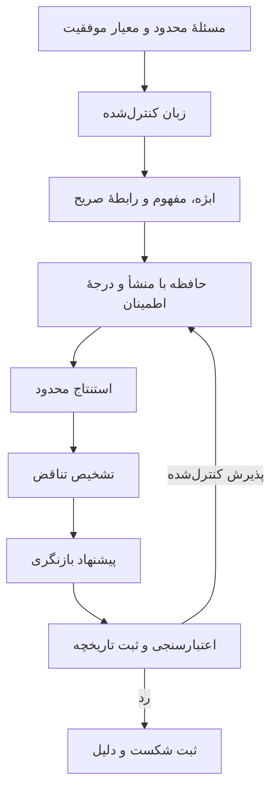
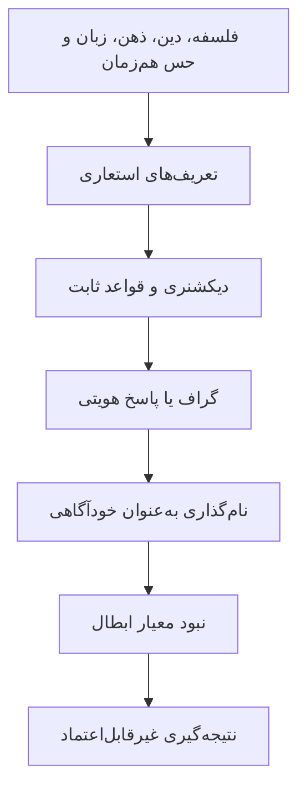
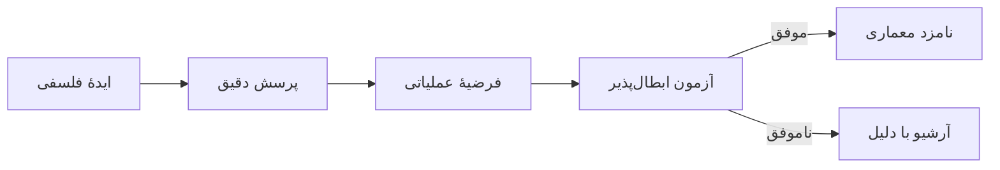

# مسیر قوی و مسیرهای ضعیف

## مسیر قوی: معماری کوچک و قابل‌آزمایش

این مسیر ادعا نمی‌کند که از ابتدا «ذهن» یا «خودآگاهی» می‌سازد. یک چرخهٔ محدود می‌سازد که بتوان درست یا غلط بودن هر مرحله را سنجید.

### چرا قوی است؟

- هر مرحله ورودی و خروجی مشخص دارد.
- خطا را می‌توان به یک لایه نسبت داد.
- تغییرات دانش ثبت و قابل‌برگشت‌اند.
- مدل زبانی می‌تواند parser یا پیشنهاددهنده باشد، اما تصمیم نهایی را هستهٔ مستقل و تست‌ها کنترل می‌کنند.
- با CPU و دادهٔ کم قابل شروع است.

### MVP پیشنهادی

1. فقط ۲۰ تا ۵۰ الگوی جملهٔ کنترل‌شده.
2. تمایز «مفهوم»، «نمونه»، «ویژگی» و «رابطه».
3. ثبت منبع، زمان و اطمینان هر گزاره.
4. چند قاعدهٔ استنتاج دقیق و محدود.
5. مجموعه‌آزمون تناقض و عدم‌تناقض.
6. بازنگری فقط به‌صورت پیشنهاد؛ پذیرش با قواعد روشن.
7. گزارش کامل اینکه هر پاسخ چگونه ساخته شده است.

## مسیر ضعیف: ادعای بزرگ پیش از تعریف آزمون

### چرا ضعیف است؟

- «فهم»، «خودآگاهی»، «بازتاب» و «خودساختاردهی» تعریف عملیاتی ندارند.
- پاسخ ازپیش‌نوشته‌شده به «من کی هستم؟» شواهد خودآگاهی نیست.
- افزودن token و edge به گراف، به‌تنهایی یادگیری معنا یا بازساخت معماری نیست.
- حرکت جوهری، روح یا مفاهیم قرآنی بدون تابع تبدیل و آزمون، الهام فلسفی‌اند نه مؤلفهٔ نرم‌افزاری.
- شروع هم‌زمان زبان، حس، حافظه، منطق و خودآگاهی اجازه نمی‌دهد بفهمیم موفقیت یا شکست از کجا آمده است.

## جای درست ایده‌های فلسفی

ایده‌های فلسفی حذف نمی‌شوند. نقش درست فعلی آن‌ها این است:

تا وقتی گذار «ایده → فرضیه → آزمون» تعریف نشده، ایده در بخش پژوهش دوربرد باقی می‌ماند و وارد هستهٔ کد نمی‌شود.

## حکم فعلی

از صفر فکری شروع نمی‌کنیم، چون پرسش‌های ارزشمند و تاریخچهٔ شکست‌ها در آرشیو وجود دارد. از نظر مهندسی تقریباً از یک هستهٔ جدید و کوچک شروع می‌کنیم، چون Notebookهای فعلی specification، تست و مرز مؤلفه ندارند.
