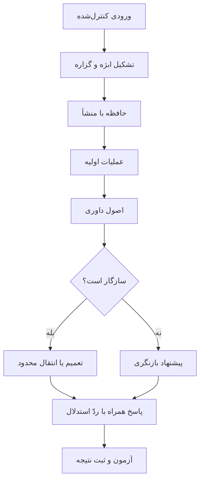

# راهبرد ساخت هستهٔ بدیهیات عقلی

## ۱. هدف

هدف پروژه ساخت یک «مغز کامل» یا اثبات فوری فهم ماشین نیست. هدف نخست ساخت یک هستهٔ کوچک، مستقل از زبان و قابل‌آزمایش است که بتواند با چند اصل و تجربهٔ محدود:

- ابژه و گزاره را از هم تفکیک کند؛
- معناهای اولیه و روابطشان را نگه دارد؛
- اثبات، نفی و ناسازگاری را تشخیص دهد؛
- میان دانستهٔ اولیه و آموختهٔ تجربی فرق بگذارد؛
- در برابر خطا، تغییر پیشنهادی و قابل‌ردیابی ایجاد کند؛
- و آموخته را به نمونه‌ای تازه منتقل کند.

نام فارسی فعلی: **هستهٔ بدیهیات عقلی**

نام فنی فعلی: **هستهٔ شناختی مبتنی بر اصول اولیه**

## ۲. فرضیهٔ مرکزی

> اگر یک سیستم به‌جای دریافت حجم بزرگی از پاسخ‌های آماده، مجموعه‌ای کوچک از معناهای اولیه، عملیات عقلی، اصول داوری و قواعد بازنگری داشته باشد، آیا می‌تواند با دادهٔ کمتر، سازگارتر و انتقال‌پذیرتر از یک سامانهٔ بدون این هسته یاد بگیرد؟

این گزاره هنوز نظریهٔ اثبات‌شده نیست؛ فرضیهٔ راهنمای طراحی و آزمایش است.

## ۳. مرز مفهومی

برای جلوگیری از مبهم‌شدن هسته، چهار چیز از هم جدا می‌شوند:

| مفهوم | جایگاه فعلی در پروژه |
|---|---|
| فطرت | منبع الهام و فرضیه دربارهٔ درونیات انسان؛ هنوز تعریف عملیاتی ندارد |
| بدیهیات عقلی | نامزدِ محتوای اولیه یا اصل داوریِ قابل‌صورت‌بندی |
| عملیات عقلی | کارهایی مانند اثبات، نفی، مقایسه، ترکیب و تفکیک |
| حالات نفس | انگیزه و ارزیابی اخلاقی؛ فعلاً خارج از MVP |

فلسفهٔ ابن‌سینا، ملاصدرا، منطق سنتی، نظریه‌های فطرت و علوم شناختی بعداً در «نقشهٔ نظریه‌های بیرونی» بررسی می‌شوند. هیچ‌کدام پیش از مطالعهٔ متن‌محور به‌عنوان معماری نهایی انتخاب نمی‌شوند.

## ۴. اجزای پیشنهادی هسته

این جدول specification نهایی نیست؛ نقشهٔ تفکیک اجزاست.

| لایه | پرسش | خروجی موردنیاز |
|---|---|---|
| معناهای اولیه | چه چیزهایی از آغاز در هسته‌اند؟ | فهرست محدود، نوع و تعریف هر مورد |
| عملیات اولیه | هسته با معناها چه می‌کند؟ | اثبات، نفی، تشخیص همان/متفاوت، جزء/کل و رابطه |
| اصول داوری | چه چیزی یک وضعیت را نامعتبر می‌کند؟ | قواعد ناسازگاری و شرایط اجرای آن‌ها |
| حافظه | چه چیزی ثابت، آموخته یا موقت است؟ | گزاره با منشأ، زمان، اطمینان و وضعیت |
| یادگیری | تجربه چگونه ساختار را تغییر می‌دهد؟ | قاعدهٔ افزودن، تعمیم، تفکیک و اصلاح |
| بازنگری | با تناقض چه می‌کند؟ | پیشنهاد تغییر، دلیل، اثر و امکان بازگشت |
| انتقال | فهم چگونه از نمونه فراتر می‌رود؟ | کاربرد یک ساختار در مسئله‌ای تازه |
| توضیح | از کجا می‌دانیم پاسخ حفظی نیست؟ | ردّ استدلال و تاریخچهٔ تصمیم |

## ۵. نامزدهای مفهومی فعلی

### تصمیم‌های تأییدشدهٔ کاربر

- بخشی از معناها از ابتدا در هسته وجود دارند.
- سه نامزد فعلی: «کل و جزء»، «وجود و عدم» و «تناقض و عدم تناقض».
- «تناقض و عدم تناقض» بنیادی‌تر به نظر می‌رسد.

### عدم‌قطعیت حفظ‌شده

کاربر هنوز دربارهٔ تقدم دقیق تناقض بر وجود/عدم مطمئن نیست. بنابراین در نسخهٔ اول نباید سلسله‌مراتب قطعی تحمیل شود. هر سه باید به‌صورت فرضیه‌های رقیب آزموده شوند:

1. تناقض اصل بنیادی است و دو مورد دیگر بر آن تکیه دارند.
2. وجود/عدم از نظر مفهومی مقدم است و تناقض اصل داوری بر گزاره‌های وجودی است.
3. این‌ها از انواع متفاوت‌اند و اصولاً نباید در یک سطح رتبه‌بندی شوند.

### نامزد مهندسیِ نیازمند تأیید

«همان و متفاوت» ممکن است برای تشخیص اینکه دو گزاره دربارهٔ یک ابژه و یک موقعیت‌اند لازم باشد. این مورد هنوز تصمیم کاربر نیست و فقط یک الزام احتمالی برای آزمون تناقض است.

## ۶. ملزومات تشکیل هسته

### ملزومات نظری

- تعریف دقیق «معنا»، «فهم»، «بدیهی»، «اصل»، «عملیات» و «یادگیری»
- تمایز محتوای فطری از قاعدهٔ فطری
- تعیین اینکه کدام بخش هسته ثابت و کدام بخش قابل‌تغییر است
- تعیین شروط هویت: یکسان‌بودن موضوع، زمان، زمینه و نسبت
- مشخص‌کردن رابطهٔ تناقض با اثبات، نفی، وجود و عدم
- نوشتن ادعاهای رقیب و حالت ابطال هرکدام

### ملزومات علمی

- مجموعه‌آزمون از پیش نوشته‌شده، پیش از تنظیم هسته
- خط پایه برای مقایسه
- معیارهای کمی و کیفی
- آزمون با دادهٔ کم
- آزمون انتقال به موقعیت جدید
- آزمون ابهام و اشتراک لفظی
- ثبت شکست‌ها و نتایج منفی
- جداسازی نتیجهٔ مهندسی از نتیجهٔ فلسفی

### ملزومات داده

نسخهٔ اول به دادهٔ حجیم نیاز ندارد. نیاز اولیه:

- ۳۰ تا ۵۰ مسئلهٔ کنترل‌شده برای تناقض و عدم‌تناقض
- ۲۰ تا ۳۰ مسئلهٔ کل/جزء
- ۲۰ تا ۳۰ مسئلهٔ وجود/عدم
- چند جفت مسئلهٔ هم‌ساخت در دو حوزهٔ متفاوت برای سنجش انتقال
- نمونه‌های عمداً مبهم که بدون تشخیص هویت معنایی حل نشوند
- برچسب دلیل، نه فقط پاسخ درست/غلط

اعداد بالا برآورد طراحی‌اند و پس از specification قابل‌اصلاح‌اند.

### ملزومات مهندسی

- Python و ساختار بسته‌ای کوچک
- نمایش صریح ابژه، مفهوم، گزاره، رابطه و منشأ
- هستهٔ قطعی و قابل‌تست؛ بدون وابستگی اجباری به مدل زبانی
- ذخیرهٔ تاریخچهٔ تغییرات و امکان بازگشت
- آزمون واحد برای هر اصل
- آزمون یکپارچه برای چرخهٔ دریافت، داوری، یادگیری و بازنگری
- رابط CLI و API ساده
- Notebook فقط برای آزمایش و نمایش، نه منبع اصلی منطق
- وابستگی‌های کم و ثبت‌شده

### ملزومات پژوهشی و حکمرانی

- دفترچهٔ تصمیم‌ها و نسخه‌ها
- منشأ هر ادعا و هر قاعده
- جداکردن نقل‌قول، تفسیر و تصمیم پروژه
- نسخه‌گذاری مجموعه‌آزمون
- جلوگیری از تغییر آزمون پس از دیدن نتیجه بدون ثبت دلیل
- حفظ شاخه‌های بازیابی پیش از تغییرهای معماری بزرگ

## ۷. معماری مفهومی اولیه



مدل زبانی در آینده می‌تواند ورودی طبیعی را به زبان کنترل‌شده تبدیل کند؛ اما نباید داور پنهانِ صحت هسته باشد.

## ۸. مسیر ساخت مرحله‌ای

### مرحلهٔ صفر: حفاظت و specification

خروجی:

- دفتر ثبت و نقاط بازیابی
- واژه‌نامهٔ مفاهیم
- تعریف انواع بدیهیات
- تعریف دقیق ورودی و خروجی
- مجموعه‌آزمون اولیه
- معیار عبور به کدنویسی

شرط پایان: بتوانیم بدون اشارهٔ استعاری توضیح دهیم هسته چه می‌گیرد، چه حالتی نگه می‌دارد و چه خروجی‌ای می‌دهد.

### مرحلهٔ یک: آزمایش تناقض در جهان کوچک

دامنه:

- چند ابژه
- گزارهٔ مثبت و منفی
- زمان و زمینهٔ صریح
- بدون زبان طبیعی آزاد

پرسش‌ها:

- آیا هسته تناقض واقعی را از تفاوت زمینه تشخیص می‌دهد؟
- آیا می‌تواند دلیل ناسازگاری را نشان دهد؟
- آیا «اطلاعات ناکافی» را با «تناقض» اشتباه نمی‌گیرد؟

شرط پایان: عبور از آزمون‌های ازپیش‌نوشته‌شده بدون قاعدهٔ مخصوص هر سؤال.

### مرحلهٔ دو: وجود/عدم و کل/جزء

دامنه:

- معرفی موجود/ناموجود
- جزء، کل و تعلق
- تفاوت «جزء نبودن» با «وجود نداشتن»
- بررسی وابستگی این مفاهیم به اصل تناقض

شرط پایان: مشخص شود سه نامزد فعلی یک نوع‌اند یا باید در لایه‌های جدا قرار گیرند.

### مرحلهٔ سه: یادگیری با مثال کم

هسته باید از چند نمونه، یک رابطهٔ جدید را پیشنهاد دهد؛ اما پذیرش آن منوط به قواعد روشن باشد.

شرط پایان: نسبت به خط پایهٔ بدون هسته، با مثال کمتر به عملکرد مشابه یا بهتر برسد و دلیل تعمیم را ارائه کند.

### مرحلهٔ چهار: انتقال بین حوزه‌ها

یک ساختار واحد در دو محتوای متفاوت آزموده می‌شود؛ برای مثال رابطهٔ کل/جزء در اشیای فیزیکی و ساختارهای انتزاعی.

شرط پایان: انتقال بدون نوشتن قاعدهٔ ویژه برای حوزهٔ دوم.

### مرحلهٔ پنج: زبان طبیعی محدود

فقط پس از پایداری هسته، parser یا مدل زبانی به‌عنوان رابط افزوده می‌شود.

شرط پایان: تغییر عبارت زبانی، در صورت ثابت‌بودن معنا، نتیجهٔ هسته را تغییر ندهد.

## ۹. شکل پیاده‌سازی پیشنهادی

```text
src/rational_core/
  primitives.py
  objects.py
  propositions.py
  memory.py
  inference.py
  consistency.py
  revision.py
  trace.py
  api.py

tests/
  fixtures/
  test_primitives.py
  test_contradiction.py
  test_existence.py
  test_part_whole.py
  test_revision.py
  test_transfer.py

specs/
  glossary.md
  primitives.md
  invariants.md
  experiment_01.md
```

این ساختار پس از تأیید specification ایجاد می‌شود و هنوز تصمیم نهایی نیست.

## ۱۰. روش استفادهٔ نسخهٔ اولیه

### API مفهومی

1. تعریف ابژه و زمینه
2. افزودن گزاره همراه با منشأ
3. درخواست ارزیابی سازگاری
4. دریافت نتیجه، دلیل و اصول فعال‌شده
5. پیشنهاد بازنگری در صورت ناسازگاری
6. اجرای مسئلهٔ انتقال و مقایسه با خط پایه

### کاربرد پژوهشی

- مقایسهٔ معماری‌های مختلف بدیهیات
- سنجش اینکه کدام اصل واقعاً ضروری است
- کشف وابستگی میان وجود، عدم، تناقض و کل/جزء
- تبدیل ادعاهای فلسفی به فرضیه‌های قابل‌رد
- تولید تاریخچهٔ روشن از موفقیت و شکست

## ۱۱. معیارهای موفقیت

| معیار | سؤال |
|---|---|
| سازگاری | آیا تناقض واقعی را بدون مثبت کاذب زیاد تشخیص می‌دهد؟ |
| نمونه‌وری داده | آیا با مثال کمتر یاد می‌گیرد؟ |
| انتقال | آیا قاعده را در محتوای تازه به کار می‌برد؟ |
| توضیح‌پذیری | آیا دلیل داوری و منشأ گزاره‌ها روشن است؟ |
| بازنگری | آیا تغییر پیشنهادی محدود، قابل‌برگشت و مستدل است؟ |
| استقلال از زبان | آیا بازنویسی زبانیِ هم‌معنا نتیجه را حفظ می‌کند؟ |
| ابطال‌پذیری | آیا می‌توان مشخص کرد چه نتیجه‌ای فرضیه را رد می‌کند؟ |

## ۱۲. نشانه‌های شکست

- هر مسئله به قاعدهٔ دست‌نویس مخصوص خود نیاز داشته باشد.
- هسته فقط واژه‌ها را تطبیق دهد و هویت معنایی را نفهمد.
- خط پایهٔ ساده با داده و محاسبهٔ مشابه همان عملکرد را داشته باشد.
- «نمی‌دانم» را با «تناقض» اشتباه بگیرد.
- تغییر دانش بدون دلیل یا امکان بازگشت انجام شود.
- موفقیت در زبان طبیعی از خود مدل زبانی بیاید و سهم هسته قابل‌تفکیک نباشد.
- نتیجهٔ مهندسی کوچک، به ادعای فلسفی بزرگ تبدیل شود.

## ۱۳. تصمیمی که قبل از کدنویسی لازم است

اولین specification باید دربارهٔ «تناقض و عدم تناقض» نوشته شود، اما هم‌زمان دو فرض رقیب را باز نگه دارد:

- تناقض بنیادی‌تر است.
- وجود/عدم از نظر مفهومی مقدم یا هم‌سطح است.

اولین کار عملی پس از این نقشه:

> ساخت واژه‌نامهٔ نسخهٔ ۰٫۱ و طراحی مجموعه‌آزمون تناقض با موضوع، زمان، زمینه، اثبات و نفیِ صریح.

پس از تأیید این specification، ساخت اسکلت کد آغاز می‌شود.
